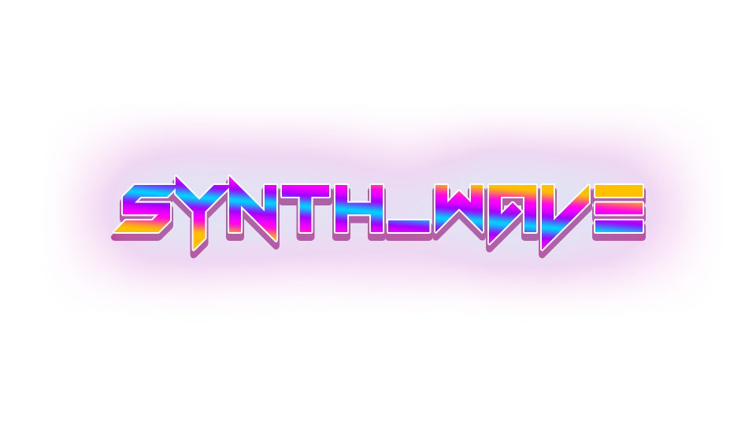

  
  <h3>Game Design Document</h3>
  <h4>Darren Sills | 20080901</h4>

[Submission Details](../README.md)

### Table of Contents
- [Game Overview](#game-overview)
  - [High-Level Overview](#high-level-overview)
  - [Mobile Device Suitability](#mobile-device-suitability)
- [Gameplay](#gameplay)
  - [Detailed Gameplay Description](#detailed-gameplay-description)
  - [Bonuses and Power-Ups](#bonuses-and-power-ups)
- [Game Progression](#game-progression)
  - [Character Progression](#character-progression)
  - [Winning and Losing](#winning-and-losing)
  - [Scoring System](#scoring-system)
- [Game Mechanics](#game-mechanics)
  - [Input Handling](#input-handling)
  - [Character and Environment Interactions](#character-and-environment-interactions)
  - [Camera Mechanics](#camera-mechanics)
  - [Defold Addressing and Messaging](#defold-addressing-and-messaging)
- [Game World](#game-world)
  - [Environment and Setting](#environment-and-setting)
  - [Visual Style](#visual-style)
- [Characters](#characters)
  - [Character Details](#character-details)
  - [Character Visuals](#character-visuals)
- [Mobile Game Design](#mobile-game-design)
  - [General Mobile Game Design Guidelines](#general-mobile-game-design-guidelines)
  - [Comparison to Your Game](#comparison-to-your-game)
  - [Adaptations for Mobile](#adaptations-for-mobile)
- [Monetization](#monetization)
  - [Monetization Strategies](#monetization-strategies)
- [Distribution](#distribution)
  - [Mobile Market Distribution](#mobile-market-distribution)

## Game Overview
### High-Level Overview
"Synth_Wave" is a rhythm-based top-down shooter game set in a vibrant, neon-lit world inspired by 1980s synth-wave aesthetics.
The game combines fast-paced shooting action with rhythm game mechanics, requiring players to aim and shoot in sync with a pulsating
synthwave soundtrack. Each level is designed around a specific track, with enemy patterns and events timed to the music,
creating an immersive and rhythmic gameplay experience. All actions are timed to the beat of the music!

### Mobile Device Suitability
The game's design caters to mobile devices with its intuitive touch controls, allowing players to easily navigate
and shoot with simple gestures and taps. The level structure is optimized for short, engaging play sessions,
perfect for on-the-go gaming. The game's vibrant visuals and soundtrack are designed to be highly engaging on smaller screens,
making "Synth_Wave" an ideal fit for mobile gaming.

The initial plan was for a twin-stick shooter, but the touch controls were deemed not intuitive enough for mobile devices in testing.

## Gameplay
### Detailed Gameplay Description
In "Synth_Wave," players must defeat waves of enemies as they move towards the player's position. 3 hits from an enemy will result in a game over, where score and time are recorded.
The player can aim via on-screen joystick and shoot via on-screen button.
The twist is that shooting is most effective when performed in rhythm with the background music, with multiple indicators of the beat available, such as a heartbeat, flashing screen, and pulsating enemies.
Each level introduces different enemy types, patterns, and of course, music, challenging players to adapt their strategy while keeping the beat.

### Bonuses and Power-Ups
Players can collect various power-ups that enhance their abilities, which include:
- **Health Pack:** Restores 1 health point.
- **Shield:** Provides 1 point of damage reduction.
- **Double Damage:** Doubles the player's damage output.
- **Large Bullet:** Increases the player's bullet size.
- **Spread Shot:** Fires 3 bullets in a spread pattern.
All power-ups last for a limited time, and can stack with each other. All timers decrement on beat.
These power-ups have a chance to spawn when an enemy is defeated, and will then float towards the player's position.

## Game Progression
### Character Progression
Each song is a level, with the enemies and events designed around the music. Upon the song's completion, the player is given a rank based on their score and time, gaining
experience points which increase their account's level. Higher levels could unlock new songs and power-ups (not implemented), with the player's account level displayed on the main menu.

### Winning and Losing
A level is won by surviving until the end of the song while defeating waves of enemies. Failure occurs if the player's health depletes entirely.
However, you can still get a high score even if you lose, with replayability encouraged by the short length of each session.

### Scoring System
The scoring system rewards players for maintaining rhythm and defeating enemies, with bonuses for consecutive on-beat actions.
Scores are tallied and the player is given an appropriate rank at the end of each level.

## Game Mechanics
### Input Handling
Buttons are controlled via touch, with an on-screen joystick for aiming in game. Input also supports mouse for desktop play via HTML5, though not recommended. 
If time permits, hiding the joystick when not in use and aiming via mouse position will be implemented.

### Character and Environment Interactions
Players interact with a variety of enemies and obstacles, each designed to challenge their rhythm and reflexes. There are 3 enemy types:
- **Basic:** Moves towards the player at a moderate speed.
- **Fast:** Moves towards the player at a faster speed, can be defeated in 1 hit if on perfect beat.
- **Tank:** Moves towards the player at a slower speed, requiring more hits to defeat.
All enemies move only on the beat, with their movement speed and patterns designed around the music.
The environment also reacts to the music, with visual effects and changes synchronized to the beat.

### Camera Mechanics
The camera maintains a top-down view, focusing on the player while providing a clear view of the surroundings and incoming threats. 
Liberal use of screen shake and visual effects will be used to enhance the game's impact.

### Defold Addressing and Messaging
The game makes heavy use of Defold's messaging system to synchronize events with the music, such as enemy spawns and attacks. 
All appropriate entities subscribe to the audio_manager, which sends appropriate messages on every beat. 
Vast majority of game logic is handled via messaging, with minimal use of timers and other methods. 
Most messaging centers on the game's manager scripts, which handle near all progression and events, like level completion, enemy spawning and scene management.

## Game World
### Environment and Setting
The game is set in a neon-lit, retro-futuristic world inspired by 1980s synthwave aesthetics. Due to the absence of a game world, per se,
this theme is instead reflected in the game's visuals, GUI and soundtrack, which are designed to be highly engaging and immersive.

### Visual Style
"Synth_Wave" sports a striking synthwave aesthetic, characterized by neon colors, retro-futuristic landscapes,
and pulsating visual effects that enhance the rhythmic gameplay.

## Characters
### Character Details
Due to the game's focus on rhythm and gameplay, there is no story or characters to speak of. Players control a faceless, nameless shooter, 
with the enemies serving as obstacles to overcome.

### Character Visuals
The player character is a simple sprite, with the enemies designed to be visually distinct and easily identifiable. 
All colors are vibrant and saturated, fitting the game's retro-futuristic aesthetic.

## Mobile Game Design
### General Mobile Game Design Guidelines
Mobile games should have intuitive controls, short play sessions, and visually appealing, often heavily stylized graphics that will catch
users eyes at a glance. They should also be heavily optimized for performance on various devices. While current hardware is quite powerful,
it is still vital to ensure that the game runs smoothly on older devices, with huge portions of the market on such devices.

### Comparison to Your Game
"Synth_Wave" aligns well with these principles through its simple touch controls, quick levels, and visually striking design. 
However, its rhythm-based gameplay presents unique challenges in ensuring precise timing and synchronization on mobile devices. 
FMOD will be used to ensure consistent audio playback across devices, which is an extremely robust and reliable audio engine.  

The built-in Defold audio engine is not suitable for this type of game, as it is not designed for precise timing and synchronization.

### Adaptations for Mobile
One key area of improvement would be to improve the experience of pausing and resuming the game, as this is a common occurrence on mobile devices.
As of now, there are minor issues with the game's audio syncing when pausing and resuming, which could be improved with further development. All issues
are however purely cosmetic, and do not affect gameplay.

## Monetization
### Monetization Strategies
The game could be monetized through in-app purchases for cosmetic items, or additional levels/songs.
An ad-supported free version could provide an alternative revenue stream. Advertising the game's soundtrack could also be a viable option, as the music is a key selling point.

## Distribution
### Mobile Market Distribution
"Synth_Wave" could be distributed through mainstream platforms like the App Store and Google Play,
as well as through indie game platforms that cater to niche audiences interested in rhythm and retro games, such as itch.io.
This project has strong potential, so with further development, it could be a great fit for the mobile market.